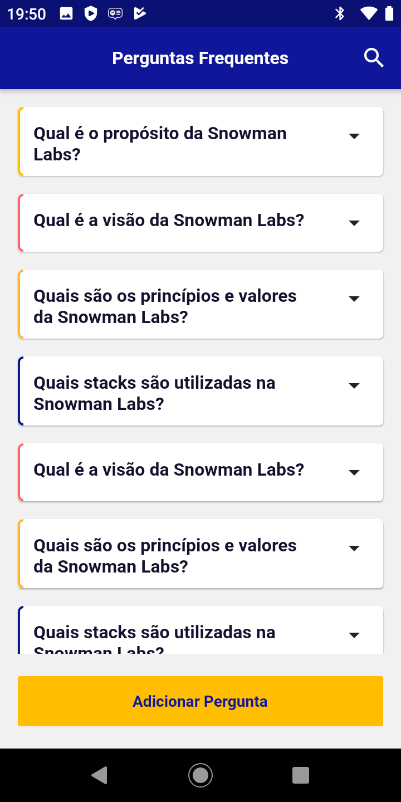

Snowman Labs Challenge
===

<br />
<p align="center">
  <a href="https://github.com/marinagosson/snowman-flutter">
    
  </a>

</p>

## User Stories

* Como usuário quero visualizar a lista de perguntas/respostas (FAQ).
* Como usuário quero clicar em uma pergunta e quero que a resposta seja exibida.
* Como usuário quero poder pesquisar uma pergunta/resposta.
* Como usuário quero poder criar uma nova pergunta/resposta.
* Como usuário quero adicionar uma cor a minha pergunta/resposta.

### DEMO

[](https://www.youtube.com/watch?v=BaZ5OJ2feAA&feature)

### O que o app traz:

1. MVVM + Clean Architecture + Respository Pattern
2. Get_It para injeção de dependencias
3. RXDart para gerenciamento de estado
4. SQFlite para trabalhar com SQLite
5. Widgets personalizados
6. Stetho para visualização do banco através do chrome inspect

## Configuração do ambiente

Projeto desenvolvido e criado utilizando o visual studio code. Para rodar o projeto, configure seu ambiente com as configurações abaixo. Para rodar o projeto basta utilizar o comando padrão do flutter: `flutter run`

```

[✓] Flutter (Channel stable, 1.20.4, on Mac OS X 10.15.7 19H2, locale en-BR)
    • Flutter version 1.20.4 at /Users/marinagosson/Library/Android/flutter
    • Framework revision fba99f6cf9 (8 weeks ago), 2020-09-14 15:32:52 -0700
    • Engine revision d1bc06f032
    • Dart version 2.9.2

 
[✓] Android toolchain - develop for Android devices (Android SDK version 30.0.2)
    • Android SDK at /Users/marinagosson/Library/Android/sdk
    • Platform android-30, build-tools 30.0.2
    • ANDROID_HOME = /Users/marinagosson/Library/Android/sdk
    • Java binary at: /Applications/Android Studio.app/Contents/jre/jdk/Contents/Home/bin/java
    • Java version OpenJDK Runtime Environment (build 1.8.0_242-release-1644-b3-6222593)
    • All Android licenses accepted.

[✓] Xcode - develop for iOS and macOS (Xcode 12.0.1)
    • Xcode at /Applications/Xcode.app/Contents/Developer
    • Xcode 12.0.1, Build version 12A7300
    • CocoaPods version 1.10.0.beta.2

[✓] Android Studio (version 4.0)
    • Android Studio at /Applications/Android Studio.app/Contents
    • Flutter plugin version 48.1.2
    • Dart plugin version 193.7547
    • Java version OpenJDK Runtime Environment (build 1.8.0_242-release-1644-b3-6222593)

[✓] VS Code (version 1.51.0)
    • VS Code at /Applications/Visual Studio Code.app/Contents
    • Flutter extension version 3.16.0

[✓] Connected device (1 available)
    • Android SDK built for x86 (mobile) • emulator-5554 • android-x86 • Android 10 (API 29) (emulator)

```